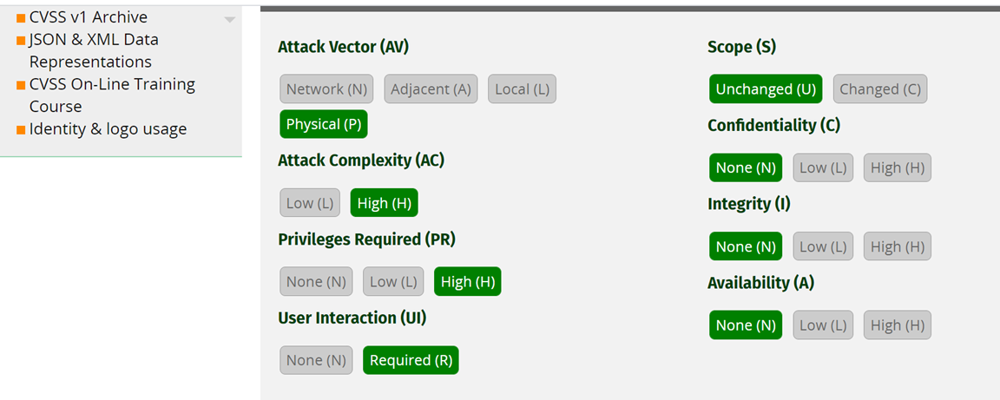

## 2.3 程式與開發安全

## Windows `Secure` programming

```
[77]下列何者不是 Windows 安全開發必須注意的地方？ 
(A) Socket 設計 (B) 多執行緒設計 (C) 常駐程式設計 (D) 封包流量設計 
```
D

## [程式碼簽署(Code Signing)](https://zh.wikipedia.org/wiki/%E4%BB%A3%E7%A0%81%E7%AD%BE%E5%90%8D)  [[Code Signing]](https://en.wikipedia.org/wiki/Code_signing)
- 代碼簽章（英語：Code signing）是對`執行檔`或`程式碼`進行`數位簽章`
- 目的==> 確認`軟體作者`及保證軟體在簽章後`未被修改或損壞`的措施。
- 技術==> 使用`雜湊(a cryptographic hash)`來驗證真實性和完整性

```
[125]程式碼簽署(Code Signing)無法提供以下哪一項功能?
(A) 確認軟體開發者的身份
(B) 防止程式碼被篡改
(C) 用戶端認證
(D) 程式碼執行時期的合法性識別
```
C

## 原始碼漏洞修補
```
[128]關於原始碼漏洞修補,下列敘述何者不正確?
(A) 所有類型的原始碼漏洞,均可找到對應的弱點掃描方法
(B) 未經驗證的使用者參數,均應加以驗證
(C) SQL Injection的源頭可能來自於 Web 頁面,亦可能來自資料庫本身資料
(D) XSS的源頭可能來自於瀏覽器的 Document Object Model(DOM)
```
A

## 通用漏洞評分系統(Common Vulnerability Scoring System,CVSS)



- 漏洞評鑑系統(Common Vulnerability Scoring System；CVSS) 由美國國家基礎建設諮詢委員會 (NIAC) 委託製作
- CVSS 是一套公開的評鑑標準，經常被用來評比企業資訊科技系統的安全性，並受到eBay、賽門鐵克(Symantec)、思科(Cisco)、甲古文(Oracle)等眾多軟體廠商支援。
- 由於CVSS是運用數學方程式來判定某特定網路的安全性是否存在弱點，普遍被認為較具中立性。


[官方網址](https://www.first.org/cvss/)

- CVSS的判定標準，不但包含威脅的嚴重性，遠端網路是否能遙控資安漏洞、利用網路弱點，攻擊者是否需要登入才會產生威脅等等，都被列入評比。
- CVSS的評分分數從0分到10分，0代表沒有發現弱點，而10則代表最高風險。


- 基本指標群(Base metric group)
- 暫時指標群(Temporal metric group)
- 環境指標群(Environmental metric group)


```
[中級2.(單選題)] 
通用漏洞評分系統(Common Vulnerability Scoring System,CVSS)
是一個可衡量漏洞嚴重程度的公開標準。
CVSSv3 以基本指標群(Base metric group)、暫時指標群(Temporal metric group)及
環境指標群(Environmental metric group)等 3 個群組來進行判斷。

關於基本指標群,下列何者「不」是其考量因素?
(A)機密性衝擊(Confidentiality Impact)
(B)攻擊途徑(Attack Vector)
(C)攻擊複雜度(Attack Complexity)
(D)可靠性衝擊(Reliability Impact)
```

D
### 逆向工程（Reverse Engineering）

```
[76]安全性測試人員可以使用反組譯器（Disassemblers）、除錯器 （Debuggers）
和反編譯器（Decompilers）來判斷與檢查，是否存在何種程式碼的弱點？ 
(A) 缺乏逆向工程（Reverse Engineering）保護 (B) 注入缺失（注射缺陷） 
(C) 跨網站指令碼（Cross-Site Scripting） (D) 不安全的物件參考（Insecure Direct Object Reference） 
```
```
A
編譯器（compilers）
c ==> gcc
c++ ==> g++
dev-c++

除錯器Debuggers ==> gdb

開發
c ==> 組合語言assemble language [intel vs AT&T]==> 執行檔{windows: PE   vs  Linux: ELF}

逆向
c <== 組合語言assemble language [intel vs AT&T]  <==執行檔[機器語言]{windows: PE   vs  Linux: ELF}

組譯器（Disassemblers）==>把組合程式變成執行檔

https://en.wikipedia.org/wiki/GNU_Assembler
   gas as


https://awesomeopensource.com/projects/disassembler
https://en.wikibooks.org/wiki/X86_Disassembly/Disassemblers_and_Decompilers

反組譯器（Disassemblers）==> 
除錯器 （Debuggers）
反編譯器（Decompilers）
```

```
https://montcs.bloomu.edu/Information/LowLevel/Assembly/assembly-tutorial.html

	hello:     db 'Hello world!',10    ; 'Hello world!' plus a linefeed character
	helloLen:  equ $-hello             ; Length of the 'Hello world!' string
	                                   ; (I'll explain soon)

section .text
	global _start

_start:
	mov eax,4            ; The system call for write (sys_write)
	mov ebx,1            ; File descriptor 1 - standard output
	mov ecx,hello        ; Put the offset of hello in ecx
	mov edx,helloLen     ; helloLen is a constant, so we don't need to say
	                     ;  mov edx,[helloLen] to get it's actual value
	int 80h              ; Call the kernel

	mov eax,1            ; The system call for exit (sys_exit)
	mov ebx,0            ; Exit with return code of 0 (no error)
	int 80h


nasm -f elf hello.asm

ld -s -o hello hello.o

./hello
```
```
[127]關於逆向工程,下列敘述何者正確?
(A) 從組合語言恢復高階語言的結構與語法過程
(B) 從機器語言恢復高階語言的結構與語法過程
(C) 從高階語言恢復組合語言的結構與語法過程
(D) 從高階語言恢復機器語言的結構與語法過程
```
B
### 行動程式開發安全性

```
[130]下列對行動碼(Mobile code),下列敘述何者不正確?
(A) 通常不具傷害性
(B) 可在不同作業系統之間執行
(C) 可在不同瀏覽器上順利執行
(D) 無法從遠端系統傳到本地端執行
```
D

```
[124]Android 系統的核心層級應用程式沙箱(Sandbox)是以何種方式來提供安全性?
(A) 每個應用程序指定唯一的使用者識別碼(UID),並執行於獨立的處理程序中
(B) 於非特權群組識別碼(GID)下執行所有應用程式
(C) 限制核心處理程序進行非法讀取
(D) 防止任何未經授權的核心處理程序執行
```
A

## PART2.安全軟體發展生命週期(Security Software DevelopmentLifecycle, SSDLC)
```
SSDLC  vs SDLC
SDLC (Software Development Life Cycle)：
軟體發展生命週期(也有稱系統發展生命週期)
進行階段分為： 需求->分析->設計->開發->測試->佈署維運 

SSDLC (Secure Software Development Life Cycle)：
安全的軟體發展生命週期(Secure SDLC 或 S-SDLC)，
從專案開始的各階段(需求->設計->開發->測試->佈署維運)

方法論:
(1)Cigital–TouchPoint Model 
(2)MS-SDL 
(3)OWASP-CLASP  SAMM
CLASP
Comprehensive, Lightweight Application Security Process
綜合性輕量級應用安全過程

  https://www.chainnews.com/zh-hant/articles/764295548
```
### SSDLC流程
```
需求分析 (Requirements) ==> 進行風險分析與確認應用程式的資安需求，以符合使用者需求與法規遵循為目的

架構設計 (Design)==> 根據需求分析結果，進行包含系統任務的目標、功能關聯、邊界範圍及各階層使用者的角色等
                    內外部使用的規劃與搭配適當的資安架構

程式實作 (Implementation) ==> 落實既有之規劃，將使用者介面、功能運作及安全性等完整的實現
                             程式設計師應隨時注意正確安全的程式撰寫習慣

測試與驗收 (Testing) ==> 依據資安需求擬訂測試計畫，並依測試計畫進行測試與修正
                         確保各項功能與安全性皆可符合既定的需求
部署與維運 (Maintenance) ==> 進行軟體之部署，安排教育訓練
                           落實軟體之穩定運作，應定期修補漏洞(Patch)、
                           按步升級更新版本(Upgrade)及即時監控(Monitor)
```

```
[126]下列何者為目前撰寫安全程式碼的知名的業界參考指引?
(A) NIST SP 800 系列
(B) OWASP 指南
(C) FIPS 系列
(D) ISO22301 相關標準
```
```
B

撰寫安全程式碼 ==> OWASP 

OWASP Application Security Verification Standard (ASVS) ver.4 (2019)

OWASP Secure Coding Practices
   https://owasp.org/www-pdf-archive/OWASP_SCP_Quick_Reference_Guide_%28Chinese%29.pdf

OWASP Top Ten Proactive Controls (2018)
OWASP Top Ten Risks (2017)
OWASP Testing Guide v4(2014)
OWASP Cheatsheet Series

https://cheatsheetseries.owasp.org/cheatsheets/DotNet_Security_Cheat_Sheet.html

安全程式碼  secure coding
Secure Coding in C and C++, 2/e (Paperback)
Robert C. Seacord  Addison Wesley  2013-04-11

萬無一失的程式碼－終結 C & C ++ 軟體漏洞 (Secure Coding in C and C++, 2/e)
Robert C. Seacord 著、賈蓉生、蔡旻嶧 譯  博碩文化 2014-12-30

The CERT C Secure Coding Standard (Paperback)
Robert C. Seacord  Addison Wesley  2008-10-01
https://www.itread01.com/content/1548583221.html

https://github.com/wkevin/CERTcn

CERT Coding Standards 包括了几门语言的编码规范：
The CERT C Secure Coding Standard
The CERT C++ Secure Coding Standard
The CERT Oracle Secure Coding Standard for Java
The CERT Perl Secure Coding Standard

https://ctts.nccst.nat.gov.tw/Download

NIST SP 800 系列:https://csrc.nist.gov/publications/sp800


```

```
[27]下列何者屬於開發安全方面需注意的問題？ 
(A) 部署時必須考量伺服器效能，避免導致應用程式效能低 
(B) 應用程式設計必須設計多線程，用戶能對服務隨時存取 
(C) 應用程式必須考量是否有 SQL 注入漏洞 
(D) 應用程式必須考量 License 限制，避免出現無法部署其他伺服器 
```
```
C

(B) 應用程式設計必須設計多線程[multi-thread]，用戶能對服務隨時存取 ===>效能問題 不是安全問題
```
```
[123]安全的系統發展生命週期(Secure Software Development Life Cycle,SSDLC)意指發展一套安全系統的順序,
用以開發完善安全的資訊系統。以下哪個不是安全的系統發展生命週期階段?
(A) 設計
(B) 需求
(C) 估價
(D) 開發
```
C

```
[中級3.(單選題)] 
關於安全軟體發展生命週期(Security Software DevelopmentLifecycle, SSDLC),
下列敘述何者正確?
(A)可區分為需求階段、設計階段、開發實作階段、測試階段以及部署維運階段
(B)可區分為 UI/UX 階段、設計階段、開發實作階段、測試階段以及部署維運階段
(C)可區分為需求階段、設計階段、測試階段、以及部署維運階段
(D)可區分為 UI/UX、設計階段、測試階段以及部署維運階段
```
A
